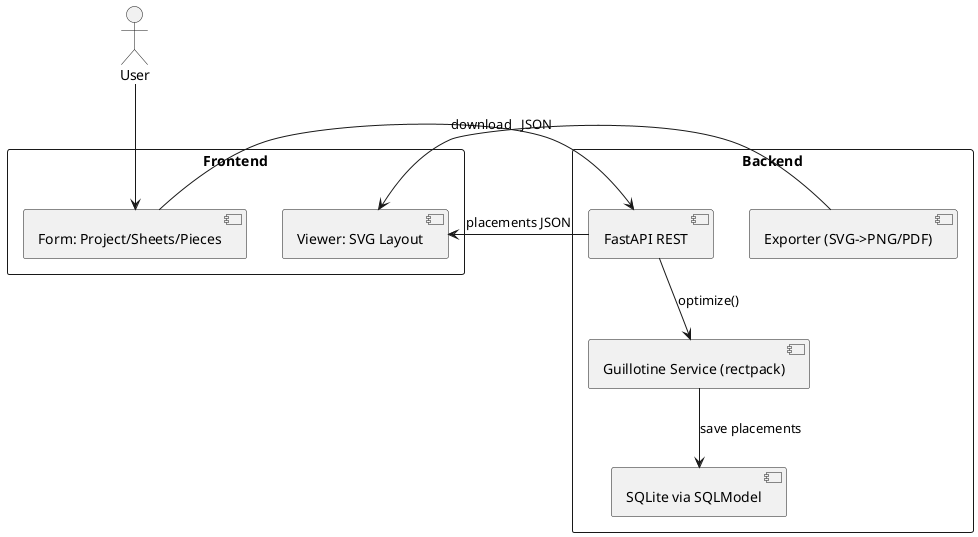

# SPEC-1-2D-Stock-Cutting-Webapp

## Background

Develop a self-hosted, single-user web application that solves the 2D rectangular stock cutting problem (multi-sheet), producing guillotine-cut friendly layouts. Target runtime is Docker (Unraid). UI is intentionally minimal.

## Requirements

**Must Have**

- Input: multiple stock sheets (W×H), list of piece sizes (W×H, qty), allow 90° rotation toggle per job.
- Compute layouts using a **Guillotine** packing heuristic.
- Visualize layouts per sheet in-browser (rectangles with coordinates and sizes).
- Run as a single-user app in Docker on Unraid.

**Should Have**

- Export layout as PNG/PDF.
- Persist/load projects locally (JSON/SQLite).
- Show utilization/waste % by sheet and overall.

**Could Have**

- Kerf/cut width parameter and safety margin.
- Piece priorities / grouping.

**Won’t Have (MVP)**

- Multi-user accounts, auth.
- Irregular nesting; only rectangles.

## Method

### Architecture

- **Frontend**: React + Tailwind (minimal form + SVG layout viewer).
- **Backend**: Python (FastAPI) service exposing REST endpoints and invoking `rectpack` Guillotine algorithm. Optional server-side export via CairoSVG.
- **Data**: SQLite (via SQLModel) for simple persistence (projects, sheets, pieces, placements). Filesystem storage for exported assets.
- **Containerization**: Single Docker image running Uvicorn/ASGI app; persistent volume for DB & exports.

### Data Model (SQLModel)

- **Project**(`id`, `name`, `created_at`, `kerf_mm` nullable, `allow_rotation` bool)
- **Sheet**(`id`, `project_id` FK, `width`, `height`, `sequence`)
- **Piece**(`id`, `project_id` FK, `width`, `height`, `quantity`)
- **Placement**(`id`, `project_id` FK, `sheet_id` FK, `piece_id` FK, `x`, `y`, `w`, `h`, `rotated` bool)

**Notes**

- Units: millimetres (int). Store as ints to avoid FP issues.
- Kerf: if set, inflate cuts by kerf when computing available spaces; pack on an effective grid where each placement reserves kerf gaps.

### API (MVP)

**`POST /api/projects`** → create project `{name, kerf_mm?, allow_rotation}` → `{project}`

**`POST /api/projects/{id}/sheets`** → add sheets `[{width,height,quantity}]` (expands to rows) → `{sheets}`

**`POST /api/projects/{id}/pieces`** → add pieces `[{width,height,quantity}]` → `{pieces}`

**`POST /api/projects/{id}/optimize`** → run guillotine packing → `{placements:[...], utilization:{bySheet, overall}}`

**`GET /api/projects/{id}/export.svg|png|pdf`** → server-side render & export

**`GET /api/projects/{id}`** → project with sheets, pieces, placements

### Algorithm – Guillotine Heuristic (via rectpack)

- Bin = sheet (W, H). Items = (w, h) repeated by quantity.
- Strategy defaults (tunable later):
  - Free rectangle selection: Best Area Fit (BAF) or Best Short Side Fit (BSSF).
  - Split rule: Shorter/Longer Axis Split (SAS/LAS) as heuristic variants.
  - Rotation: enabled/disabled per project.
- Kerf handling: subtract kerf from usable width/height, and add kerf spacing around placed rectangles (implemented by inflating each item by kerf in both dimensions and adjusting coordinates back when rendering).

### PlantUML – Component & Flow



### Placement Coordinates

- Origin (0,0) at sheet top-left. Increase x → right, y → down. All integers (mm).
- Each `Placement` stores final (x,y,w,h) post-rotation & kerf adjustments.

## Implementation

### Backend (FastAPI + rectpack)

**Key dependencies**: `fastapi`, `uvicorn[standard]`, `sqlmodel`, `rectpack`, `pydantic`, `cairosvg`

**Folder layout**

```
server/
  app.py
  models.py
  schemas.py
  services/
    optimizer.py
    export.py
  db.sqlite3
  requirements.txt
frontend/
  ... (React app)
Dockerfile
docker-compose.yml
```

**`requirements.txt`**

```
fastapi==0.115.6
uvicorn[standard]==0.30.6
sqlmodel==0.0.21
rectpack==0.2.2
pydantic==2.9.2
cairosvg==2.7.1
```

**`models.py` (SQLModel)**

```python
from sqlmodel import SQLModel, Field, Relationship
from typing import Optional
from datetime import datetime

class Project(SQLModel, table=True):
    id: Optional[int] = Field(default=None, primary_key=True)
    name: str
    created_at: datetime = Field(default_factory=datetime.utcnow)
    kerf_mm: Optional[int] = None
    allow_rotation: bool = True

class Sheet(SQLModel, table=True):
    id: Optional[int] = Field(default=None, primary_key=True)
    project_id: int = Field(foreign_key="project.id")
    width: int
    height: int
    sequence: int

class Piece(SQLModel, table=True):
    id: Optional[int] = Field(default=None, primary_key=True)
    project_id: int = Field(foreign_key="project.id")
    width: int
    height: int
    quantity: int

class Placement(SQLModel, table=True):
    id: Optional[int] = Field(default=None, primary_key=True)
    project_id: int = Field(foreign_key="project.id")
    sheet_id: int = Field(foreign_key="sheet.id")
    piece_id: int = Field(foreign_key="piece.id")
    x: int
    y: int
    w: int
    h: int
    rotated: bool = False
```

**`services/optimizer.py`** (core logic)

```python
from rectpack import newPacker
from rectpack import GuillotineBafSas, PackingMode, MaxRectsBssf

KERF_DEFAULT = 0

def pack(project, sheets, pieces):
    kerf = project.kerf_mm or KERF_DEFAULT
    # Build packer: one bin per sheet
    packer = newPacker(
        mode=PackingMode.Offline, # pack once with all items
        bin_algo=GuillotineBafSas, # guillotine strategy
        rotation=project.allow_rotation
    )

    for s in sheets:
        # Reduce usable area by kerf spacing on boundaries if desired
        packer.add_bin(s.width - kerf, s.height - kerf, count=1)

    # Inflate pieces by kerf to reserve spacing between cuts
    for p in pieces:
        for _ in range(p.quantity):
            w = max(1, p.width + kerf)
            h = max(1, p.height + kerf)
            packer.add_rect(w, h, rid=p.id)

    packer.pack()

    placements = []
    for bi, abin in enumerate(packer)
        :
        sheet_width, sheet_height = abin.width, abin.height
        for rect in abin:
            x, y, w, h, rid = rect.x, rect.y, rect.width, rect.height, rect.rid
            rotated = False
            # Undo kerf inflation for final dims
            fw, fh = max(1, w - kerf), max(1, h - kerf)
            placements.append({
                "bin_index": bi,
                "piece_id": rid,
                "x": x,
                "y": y,
                "w": fw,
                "h": fh,
                "rotated": rotated
            })
    return placements
```

**`services/export.py`** (SVG → PNG/PDF)

```python
from cairosvg import svg2png, svg2pdf

def to_png(svg_str: str, out_path: str):
    svg2png(bytestring=svg_str.encode("utf-8"), write_to=out_path)

def to_pdf(svg_str: str, out_path: str):
    svg2pdf(bytestring=svg_str.encode("utf-8"), write_to=out_path)
```

**`app.py`** (FastAPI wiring, minimal)

```python
from fastapi import FastAPI, HTTPException
from sqlmodel import SQLModel, Session, create_engine, select
from models import Project, Sheet, Piece, Placement
from services.optimizer import pack

engine = create_engine("sqlite:///db.sqlite3", connect_args={"check_same_thread": False})
app = FastAPI()

@app.on_event("startup")
def on_startup():
    SQLModel.metadata.create_all(engine)

@app.post("/api/projects")
def create_project(p: Project):
    with Session(engine) as s:
        s.add(p); s.commit(); s.refresh(p)
        return p

@app.post("/api/projects/{pid}/sheets")
def add_sheets(pid: int, sheets: list[Sheet]):
    for i, sh in enumerate(sheets):
        sh.project_id = pid
        sh.sequence = i
    with Session(engine) as s:
        s.add_all(sheets); s.commit()
        return sheets

@app.post("/api/projects/{pid}/pieces")
def add_pieces(pid: int, pieces: list[Piece]):
    for pc in pieces:
        pc.project_id = pid
    with Session(engine) as s:
        s.add_all(pieces); s.commit()
        return pieces

@app.post("/api/projects/{pid}/optimize")
def optimize(pid: int):
    with Session(engine) as s:
        project = s.exec(select(Project).where(Project.id==pid)).one()
        sheets = s.exec(select(Sheet).where(Sheet.project_id==pid)).all()
        pieces = s.exec(select(Piece).where(Piece.project_id==pid)).all()
        if not sheets or not pieces:
            raise HTTPException(400, "Sheets and pieces required")
        placements = pack(project, sheets, pieces)
        # Map bin_index -> sheet.id by sequence
        by_seq = {sh.sequence: sh.id for sh in sheets}
        rows = []
        for pl in placements:
            rows.append(Placement(
                project_id=pid,
                sheet_id=by_seq.get(pl["bin_index"], sheets[0].id),
                piece_id=pl["piece_id"],
                x=pl["x"], y=pl["y"], w=pl["w"], h=pl["h"], rotated=pl["rotated"]
            ))
        s.add_all(rows); s.commit()
        # Utilization
        tot_area = sum(sh.width*sh.height for sh in sheets)
        used_area = sum(r.w*r.h for r in rows)
        return {"placements": rows, "utilization": {"overall": used_area/tot_area}}
```

### Frontend (React + Tailwind + SVG)

**Key screens**

- **Home / Project**: inputs for name, kerf, allow_rotation; add sheets and pieces (inline tables); button: Optimize.
- **Viewer**: per-sheet SVG canvas rendering placements; legend + utilization.

**SVG rendering rule**

- Compute scale: `scale = min(canvasW/sheetW, canvasH/sheetH)`; draw sheet rect; draw each placement scaled; label piece W×H.

**Minimal React structure**

```
frontend/
  src/
    App.tsx
    api.ts (fetch helpers)
    components/
      ProjectForm.tsx
      SheetList.tsx
      PieceList.tsx
      LayoutViewer.tsx
```

**`LayoutViewer.tsx` (core idea)**

```tsx
export function LayoutViewer({sheet, placements, size={w:800,h:600}}){
  const scale = Math.min(size.w/sheet.width, size.h/sheet.height)
  return (
    <svg width={size.w} height={size.h} className="bg-gray-50">
      <g transform={`translate(10,10)`}>
        <rect width={sheet.width*scale} height={sheet.height*scale} fill="#fff" stroke="#111"/>
        {placements.map((p,i)=> (
          <g key={i}>
            <rect x={p.x*scale} y={p.y*scale} width={p.w*scale} height={p.h*scale} fill="#60a5fa" stroke="#1d4ed8"/>
            <text x={(p.x+p.w/2)*scale} y={(p.y+p.h/2)*scale} fontSize={10} textAnchor="middle" fill="#111">{p.w}×{p.h}</text>
          </g>
        ))}
      </g>
    </svg>
  )
}
```

### Dockerization (Unraid-friendly)

**`Dockerfile` (multi-stage tiny image)**

```dockerfile
FROM python:3.12-slim AS base
WORKDIR /app
COPY server/requirements.txt .
RUN pip install --no-cache-dir -r requirements.txt
COPY server/ /app/
EXPOSE 8000
CMD ["uvicorn", "app:app", "--host", "0.0.0.0", "--port", "8000"]
```

**`docker-compose.yml`**

```yaml
services:
  cutter:
    build: .
    container_name: cutter
    restart: unless-stopped
    ports:
      - "8000:8000"
    volumes:
      - ./server/db.sqlite3:/app/db.sqlite3
      - ./exports:/app/exports
```

### Export Pipeline

- Frontend requests `/api/projects/{id}` and renders SVG per sheet.
- For server-side export, POST raw SVG to `/api/projects/{id}/export` with `format=png|pdf`; backend uses CairoSVG to write file under `/app/exports` and returns a download URL.

### Validation & Units

- Enforce positive integers for dimensions and qty.
- Optional max limits: e.g., `max_sheets=200`, `max_pieces=2000` to keep runtime fast.

## Milestones

1. **M0 – Skeleton**: FastAPI project, DB models, React scaffold, Docker build runs.
2. **M1 – Packing**: Implement optimizer service, pack single project with multiple sheets; render SVG.
3. **M2 – Persistence**: Save/load projects; list recent projects.
4. **M3 – Export**: PNG/PDF export; utilization metrics.
5. **M4 – Quality**: Kerf support, rotation toggle, basic error handling and validation.

## Gathering Results

- **Functional tests**: deterministic inputs/outputs snapshot for placements.
- **Performance**: measure time vs. number of rectangles; target < 2s for ≤ 1,000 pieces, ≤ 20 sheets on typical Unraid CPU.
- **Utilization KPI**: report overall %; compare with simple shelf baseline (internal dev test) to ensure improvement.
- **User feedback**: verify readability of labels and printouts.

## Need Professional Help in Developing Your Architecture?

Please contact me at [sammuti.com](https://sammuti.com) :)
