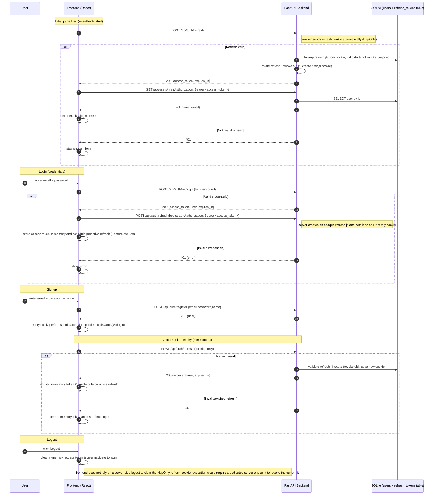

# Documentation

## Auth flow

```mermaid
sequenceDiagram
    autonumber
    participant U as User
    participant FE as Frontend (React)
    participant API as FastAPI Backend
    participant DB as SQLite (users + refresh_tokens table)

    Note over FE: Initial page load (unauthenticated)
    FE->>API: POST /api/auth/refresh
    Note right of API: browser sends refresh cookie automatically (HttpOnly)
    alt Refresh valid
        API->>DB: lookup refresh jti from cookie, validate & not revoked/expired
        API->>API: rotate refresh (revoke old jti, create new jti cookie)
        API-->>FE: 200 {access_token, expires_in}
        FE->>API: GET /api/users/me (Authorization: Bearer <access_token>)
        API->>DB: SELECT user by id
        API-->>FE: {id, name, email}
        FE->>FE: set user, skip login screen
    else No/invalid refresh
        API-->>FE: 401
        FE->>FE: stay on login form
    end

    Note over U,FE: Login (credentials)
    U->>FE: enter email + password
    FE->>API: POST /api/auth/jwt/login (form-encoded)
    alt Valid credentials
        API-->>FE: 200 {access_token, user, expires_in}
        FE->>API: POST /api/auth/refresh/bootstrap (Authorization: Bearer <access_token>)
        Note right of API: server creates an opaque refresh jti and sets it as an HttpOnly cookie
        FE->>FE: store access token in-memory and schedule proactive refresh (~before expires)
    else Invalid credentials
        API-->>FE: 401 {error}
        FE->>FE: show error
    end

    Note over U,FE: Signup
    U->>FE: enter email + password + name
    FE->>API: POST /api/auth/register {email,password,name}
    API-->>FE: 201 {user}
    FE->>FE: UI typically performs login after signup (client calls /auth/jwt/login)

    Note over FE,API: Access token expiry (~15 minutes)
    FE->>API: POST /api/auth/refresh (cookies only)
    alt Refresh valid
        API->>DB: validate refresh jti rotate (revoke old, issue new cookie)
        API-->>FE: 200 {access_token, expires_in}
        FE->>FE: update in-memory token & reschedule proactive refresh
    else Invalid/expired refresh
        API-->>FE: 401
        FE->>FE: clear in-memory token and user force login
    end

    Note over U,FE: Logout
    U->>FE: click Logout
    FE->>FE: clear in-memory access token & user navigate to login
    Note right of FE: frontend does not rely on a server-side logout to clear the HttpOnly refresh cookie revocation would require a dedicated server endpoint to revoke the current jti

    %% Implementation details:
    %% - Refresh cookie: name = REFRESH_COOKIE_NAME, HttpOnly, secure depends on env, SameSite defaults to "lax".
    %% - Access tokens: short-lived JWTs (15 minutes) issued by fastapi-users / JWTStrategy.
    %% - No CSRF token is currently used for the refresh endpoint (refresh is cookie-based and /bootstrap uses Bearer auth).
```
