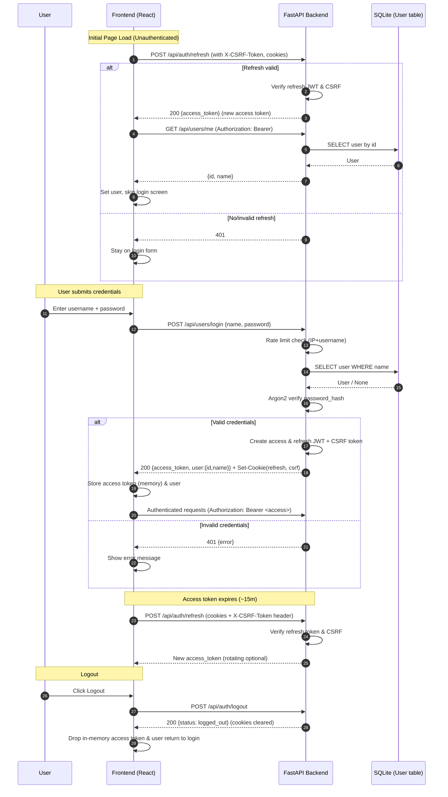

# READ ME

## Self hosting

- npm build
- copy ./frontend/build /appdata/compose/stroptimise/frontend_build
- copy ./frontend/default/conf /appdata/compose/stroptimise/nginx/default.conf
- copy ./server /appdata/compose/stroptimise/server
- copy ./env /appdata/compose/stroptimise/env
- copy ./dockerCompose /appdata/compose/stroptimise/dockerCompose
- copy ./Dockerfile /appdata/compose/stroptimise/Dockerfile

compose up

## Local Dev

### Frontend

npm start

### Server

On Windows, install deps and run server:

```powershell
cd .\server\
py -m venv .venv
.\.venv\Scripts\Activate.ps1
py -m pip install -r requirements.txt
py -m uvicorn app:app --reload --host 0.0.0.0 --port 9050
```

## Auth flow


